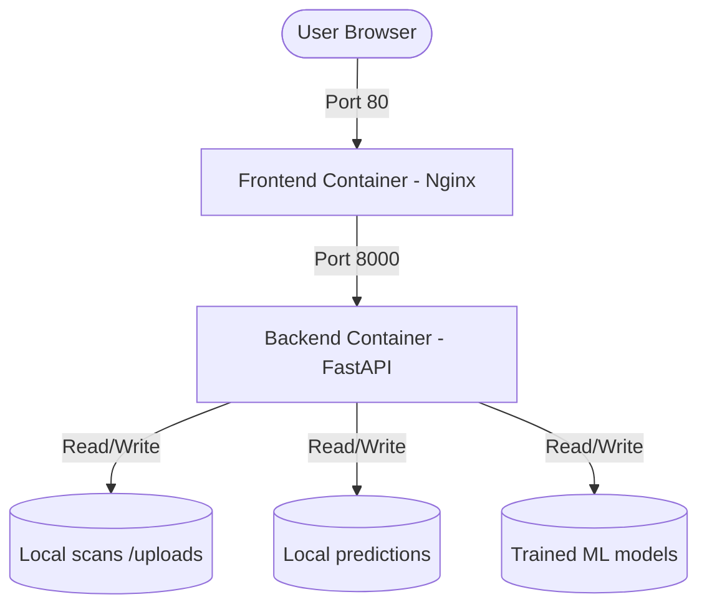

# Dentex Project Setup & Deployment Guide

This document provides a complete guide to the Dentex project configuration, the Git version control steps taken, the Docker architecture (images and containers), and the troubleshooting steps resolved during the setup.

---

## 📋 Table of Contents
1. [Git Version Control & Repository Actions](#1-git-version-control--repository-actions)
2. [Docker Architecture (Images & Containers)](#2-docker-architecture-images--containers)
3. [Troubleshooting & Dependency Fixes](#3-troubleshooting--dependency-fixes)
4. [Deployment & Run Guide](#4-deployment--run-guide)

---

## 1. Git Version Control & Repository Actions

A complete repository cleanup and commit process was performed to ensure the codebase remains clean, secure, and ready for collaboration.

* **Excluded Local Database State**: Added `backend/app/database/users.json` to the root `.gitignore` file to ensure local test users are not committed to GitHub.
* **Environment Templates**: Created `backend/.env.example` and `frontend/.env.example` to allow developers to set up their environments easily without exposing sensitive keys.
* **Staged & Committed Changes**: All modified and untracked files were staged and committed with the message:
  > *"Refactor backend and frontend codebase: update user/prediction APIs, cleanup dashboards and reports, update config, and configure environment templates"*
* **GitHub Push**: Successfully pushed the branch `main` to the remote GitHub repository at `https://github.com/Piyush2004gupta/Dentex.git`.

---

## 2. Docker Architecture (Images & Containers)

The project is structured to run as a multi-container Docker application utilizing **Docker Compose**.



### 🖼️ Docker Images

1. **`dentex-frontend:latest`** (Size: ~93MB)
   * **Base Stage**: `node:20-alpine` (to build the React/TypeScript assets).
   * **Production Stage**: `nginx:alpine` (serves compiled static files via Nginx).
   * **Port**: Exposed on port `80` inside the container and mapped to port `80` on the host system.

2. **`dentex-backend:latest`** (Size: ~10.1GB / 3.5GB content)
   * **Base Image**: `python:3.10-slim`.
   * **Features**: Houses OpenCV, Pillow, PyTorch (Torch), Keras, and Ultralytics (YOLO) for computer vision dental predictions.
   * **Port**: Exposed on port `8000` inside the container and mapped to port `8000` on the host.

### 📦 Containers Layout

| Container Name | Service | Local Port | Inside Container Port | Volume Bindings / Mounts |
| :--- | :--- | :--- | :--- | :--- |
| **`dentex-frontend`** | Frontend Web Server | `80` | `80` | None (Static bundle baked in Nginx) |
| **`dentex-backend`** | FastAPI Uvicorn Server | `8000` | `8000` | `./backend/uploads:/workspace/uploads`<br>`./backend/predictions:/workspace/predictions`<br>`./backend/trained_models:/workspace/trained_models` |

---

## 3. Troubleshooting & Dependency Fixes

During the Docker building and execution phases, two critical errors were resolved:

### 🛠️ Deprecated system library (`libgl1-mesa-glx`)
* **Problem**: The backend Docker build failed with `E: Package 'libgl1-mesa-glx' has no installation candidate` because the package has been deprecated in newer Debian base images used by `python:3.10-slim`.
* **Resolution**: Updated `backend/Dockerfile` to install `libgl1` and `libglib2.0-0` which successfully fulfills the library requirement for OpenCV and Pillow image loading.

### 🛠️ Missing Pydantic validator (`email-validator`)
* **Problem**: The backend container crashed on startup with `ImportError: email-validator is not installed, run pip install 'pydantic[email]'` when loading user registration schemas using Pydantic.
* **Resolution**: Added `email-validator>=2.0.0` directly to `backend/requirements.txt` to bake it into the backend image.

---

## 4. Deployment & Run Guide

### 🚀 Running the entire stack (Recommended)
To run both backend and frontend services simultaneously:
```bash
docker compose up -d
```
* The `-d` flag runs the containers in detached (background) mode.
* Access the frontend at: `http://localhost/`
* Access the API docs (Swagger) at: `http://localhost:8000/docs`

### 🔄 Rebuilding the images
If you modify dependency files (`requirements.txt` or `package.json`):
```bash
docker compose up --build -d
```

### 🛑 Stopping the containers
```bash
docker compose down
```
This stops and cleans up the active containers and networks to prevent file locks.
